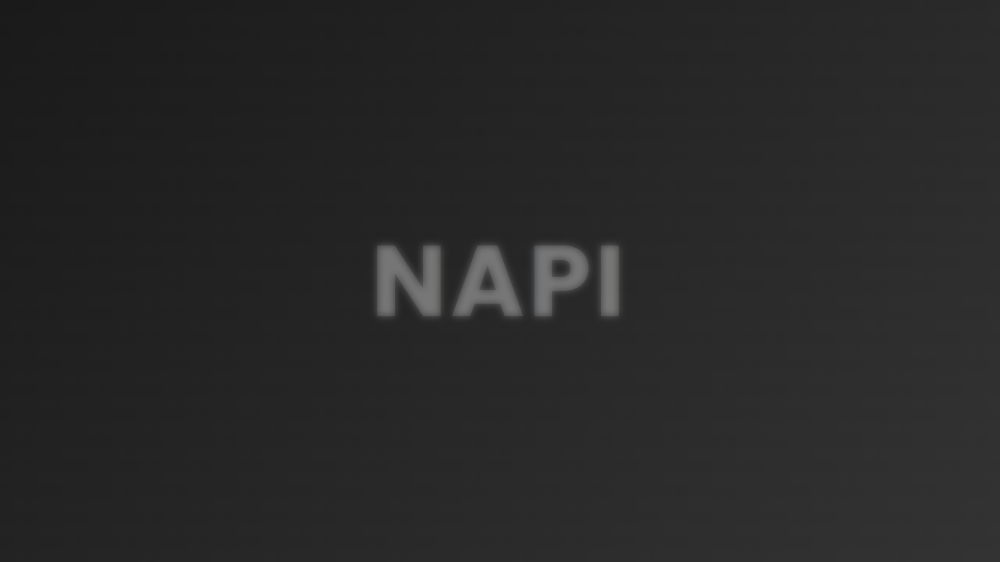

# 👋 Selam, ben Ceyhun!

Minecraft eklentileri geliştiriyorum. Genellikle güzel olacağını düşündüğüm eski sistemleri yenileyerek ücretsiz şekilde paylaşıyorum. Sunucu sahiplerinin işlerini kolaylaştıracak, otomasyon tarzı sistemleri geliştirmeyi seviyorum. 

  

---

## 🌟 Hakkımda
- 💻 **Ne Yapıyorum**: Java ile Minecraft eklentileri kodluyorum.
- 🎯 **Hedefim**: Kullanıcıların seveceği ve işlerini kolaylaştırıcak projeler yapmaya çalışıyorum.
- 🎮 **Tutkum**: Çoğu işleri database ile otomasyona bağlamak.

---

## 📎 Teknolojiler & Araçlar

  
  
  
  

---

## 🚀 Öne Çıkan Projeler

  <table>
    <tr>
      <td align="center" width="50%">
        
         
        <b><a href="https://github.com/aysihuniks/NClaim">NClaim</a></b>
        
Özelleştirilebilen, yetkililer için birçok ayarlamaları mevcut claim sistemi.

        
      </td>
      <td align="center" width="50%">
        
         
        <b><a href="https://github.com/aysihuniks/NAPI">NAPI</a></b>
        
Minecraft yml ayarlarını web arayüzüne taşıyan kullanışlı bir API.

        
      </td>
    </tr>
  </table>

---

## 📊 Kod Maceralarım

  
  

---

## 🏆 Başarılarım

  

---

## 📞 İletişime Geç

  
  

